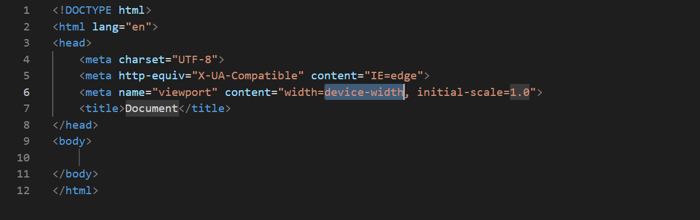

# Kodluyoruz İlk Repo

Bu repo Kodluyoruz Java Eğitiminde oluşturduğum ilk repo. İçersinde bir adet README dosyası barındırıyor.

## Installation

Öncelikle projeyi klonlayın.

`https://github.com/ozlemkrblt/kodluyoruzilkrepo.git`

## Usage

Projeyi cloneladıktan sonra dilediğiniz IDE'de açınız.

Linux için: 

``` cd kodluyoruzilkrepo
code  ```

## Contributing

Pull requestler kabul edilir. Büyük değşiklikler için lütfen önce neyi değiştirmek istediğinizi tartışmak için bir konu açınız.

## License

[MIT] ( https://choosealicense.com/licenses/mit/ ) 